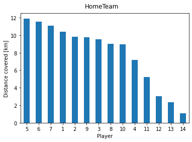
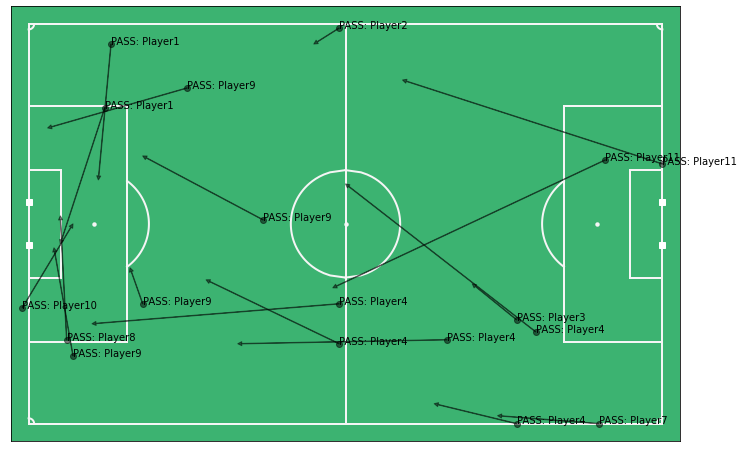
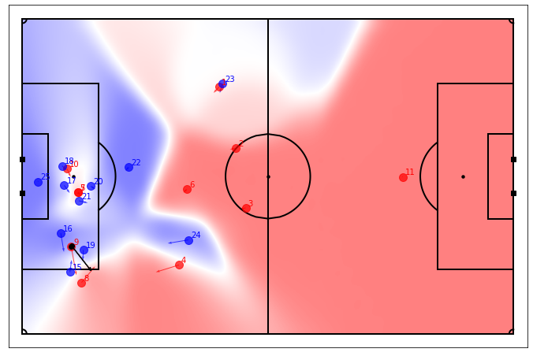

# Football data science

Based on tutorials by [Friends of tracking](https://github.com/Friends-of-Tracking-Data-FoTD)

## Tutorial 1
### Basics of using event data
- Incorporate metric coordinates into events data - to measure speed in m/s and goal distance in m, etc.
- Plot players, passes and shots
  
  `1. Kick off`
  
  
  
  `2. Defenders movement trace during first minute of the game`
  
  
  
  `3. Player postions at instance of goal by player 9`
  
  
  
  `4. Passes leading up to player9's goal`
  
  
  
  
## Tutorial 2
### Player velocities
- Calculate player velocities, minutes played, distance covered for each player using tracking data
  
  `Player velocities`
  
  
- Classify distance covered amongst walking, jogging, running, sprinting - plot clustered bar chart
  
  `Distance covered at different speeds`
  
  

- How many sprints? What directions? - plot trajectories

  `Sprints by player 10`
  
  
  
- Extra:
  1. Plot passes and shots leading up to the second and and third goal
  
  `1. Second goal with passes`
  
  
  
  `2. Third goal with passes`
  
  
  
  2. Plot all player9 shots for home team. Visually differentiate goal and no-goal shots
  
  `Shots attempted by player9`
  
  
  
  3. Plot postitions of all players at player10's goal using tracking data
  
  `Player postions at time of goal`
  
  
  
  4. Display distance covered using a bar chart
  
  `1. Distance covered by home and away team players`
  
  
  

 
## Tutorial 3
### Pitch Control
 - Create a pitch control model using parameters `{ frame index, events, tracking_home, tracking_away, static_default_params_dict, GK_numbers, field_dim}` 
    where `static_default_params_dict` includes max_player_speed, max_player_acceleration, average_ball_speed, reaction_time  etc default observed values
 - Plot pitch control for 3 passes leading up to the second goal of the game
 
 `1. Pitch control when player21 passes`
 
 
 
 `2. Pitch control when player19 passes`
 
 
  
 `3. Pitch control when player23 passes`
  
 
   
 - Calculate and plot pass probablity for every successful pass by the home team
 
 `Pass probablity for home team's successful passes`
 
 
 
 - Plot risky passes - successful passes with low probability
 
 `Risky passes`
 
 
   
    
## Tutorial 4
### Expected Possession Value

Pitch control can identify where on the field a team can pass the ball and retain possession.
However, it does not tell you the 'value' of those passing options. A new pass is as good as any other. 

We want to value pasing options to identify best passing options that increase the probability of scoring

EXPECTED POSSESSION VALUE (EPV)
EPV = Pposs (G | situation) -> Probability that the possession will result in a Goal, given the current situation
                               - value of possessing the ball at any given situation
                               
EPV = Pposs (G | situation) = Pposs(G | ball, team, opponents, match state)

      -- ball - where is the ball, pall position,
      -- team - position and velocity of team players in possession,
      -- opponents - position and velocity of opponent players not in possession,
      -- match state - open play, set piece, score line, time left
      
For simplicity:
                               
EPV = Pposs (G | situation) = Pposs(G | ball, match state)

      -- ball - where is the ball, pall position
      -- match state - open play, set piece, score line, time left

Think of possession as sequences of states.
Next state is dependent on the current state - Markov process

States can be:
    1. zones on the fields - eg simple grid
    2. set piece
    3. goal (end state)
    4. loss of possession (end state)
    
Core of the model is to calculate the probability of moving from the current state into another

Given the current position of the ball, what is the prob that:
    - The ball is successfully moved to another location on the field?
    - A set piece is awarded (corner, penalty, feekick)?
    - Goal is scored?
    - Possession is lost?
    
Use a transition matrix between states

Takes a lot of data to develop a EPV model

EPV model: https://chart-studio.plotly.com/~laurieshaw/71/#/

---

Value of a pass

The value of a completed action is the difference between the EPV value of the two states

A pass from position Ri to Rf:
        value added = EPV(Rf) - EPV(Ri)

But what about when a player possession wants to pick the best pass option?

An expected value at Rf is:
    PitchControl(Rf) x EPV(Rf)
    
The current expected value at Ri is:
    PitchControl(Ri) x EPV(Ri)
    
Expected value-added of the passing option is:
    PitchControl(Rf) x EPV(Rf) - PitchControl(Ri) x EPV(Ri)

 - Plot risky passes - successful passes with low probability
 
 `EPV grid`
 
 

 `EPV at assist instance`
 
 

`EPV x Pitch Control home`

 

 

`EPV x Pitch Control away`

 

 